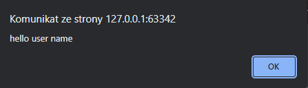

In this case study you have to:

Create page where:

1. User will see text: "What's your name?"
2. In input user will write his name
3. After pressing button user will see `alert` that says: "Hello [userName]":  
   
4. When user will not provide name (if input is empty) alert should not be rendered
5. User should also see his name bellow input, e.g. "Previous name: [userName]"

Tip:  
use `alert()` for greeting user (: 
